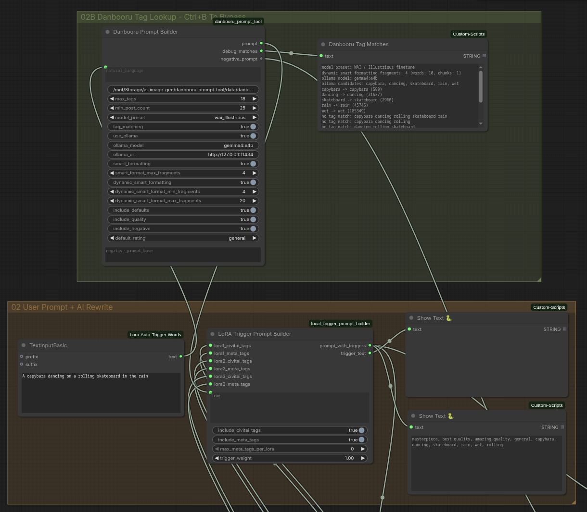

# Danbooru Prompt Tool

Turn a plain-language image idea into a cleaner anime/booru prompt for ComfyUI.

This custom node uses a local Danbooru tag database plus an optional local
Ollama model. The LLM proposes candidate tags, SQLite verifies them against
real Danbooru tag counts, and Smart Formatting repairs the pieces that do not
map cleanly to tags.



## What It Does

- Converts natural language into Danbooru-style tags.
- Ranks tag matches by local Danbooru post counts.
- Shows a debug log explaining every match and miss.
- Adds model-specific positive, negative, score, and rating tags through presets.
- Can skip tag matching while still adding defaults, quality tags, rating tags,
  and negative output.
- Preserves special tags for Pony-style models, such as `source_anime` and
  `rating_explicit`.
- Preserves Anima `@style` tags, including inline and weighted forms such as
  `@bluethebone` and `(@style_token:1.2)`.
- Lets you hand-edit a negative prompt base while still appending preset
  negative tags after it.
- Dynamically scales Smart Formatting from short prompts to long scene briefs.
- Adds `score_9, score_8_up, score_7_up, score_6_up` only when the prompt says
  `use scoring`, except for presets where score tags are required.
- Runs inside ComfyUI as `Danbooru Prompt Builder`.
- Also works from the command line.

## Why This Exists

SDXL anime models are less forgiving than older SD 1.5 workflows. A long natural
sentence often contains concepts that do not exist as clean Danbooru tags, while
short booru prompts can miss relationships, pose direction, lighting, or scene
intent.

This tool splits the job:

1. Ollama reads your natural-language idea and proposes likely tags.
2. SQLite checks those tags against a local Danbooru tag database.
3. The resolver adds synonyms, common concept expansions, and conflict checks.
4. Smart Formatting asks Ollama to recover the still-unmatched details as short
   natural-language prompt fragments.
5. The selected model preset adds the correct quality, rating, and negative tags.

The LLM does not get final authority over the prompt. The database remains the
source of truth for tag matching.

## Current Status

This is a working local tool tuned through practical ComfyUI testing. It is
ready for public release as a workflow helper, but the presets should still be
treated as model-family defaults rather than official checkpoint recipes.

Known strengths:

- WAI-Illustrious and Illustrious-style anime/furry prompting.
- WAI-Anima Base 1.0 / Anima-style prompting, including `@style` tags.
- Prompt coherence improvements from Smart Formatting.
- Debuggability: you can see which words matched and which did not.
- ComfyUI workflows where you want to copy, edit, and iterate on prompts.
- Editable negative prompt bases for solving model-specific artifacts such as
  unwanted text, captions, signatures, or watermark-like clutter.

Known limitations:

- It is not a replacement for face/detail fixers such as ADetailer-style passes.
- It does not guarantee perfect subject ownership, for example who holds a sword.
- Model presets are best-effort defaults. Always prefer a checkpoint author's
  latest model card when it conflicts with this README.
- WAI-Anima Base 1.0 uses a different score format from WAI-Illustrious and
  Pony. Use the Anima presets for Anima models.

## Requirements

- Python 3.10 or newer.
- A local Danbooru tag SQLite database created by this tool.
- Optional: Ollama running locally for LLM candidate extraction and Smart
  Formatting.
- Optional: ComfyUI for the custom node workflow.

Tested locally with:

- ComfyUI `0.22.0`
- Ollama model `gemma4:e4b`
- WAI-Illustrious SDXL workflow
- WAI-Anima Base 1.0 workflow with the Anima text encoder and VAE

## Quick Start

Clone the repo and enter it:

```bash
git clone <your-repo-url>
cd danbooru-prompt-tool
```

Create or edit `.env`:

```bash
cp .env.example .env
```

Seed a small starter database:

```bash
python -m danbooru_prompt_tool seed --db data/danbooru_tags.sqlite
```

Build a prompt:

```bash
python -m danbooru_prompt_tool prompt \
  --db data/danbooru_tags.sqlite \
  "use scoring catgirl sitting on a bed, black hair, red eyes, soft morning light"
```

Search tags directly:

```bash
python -m danbooru_prompt_tool search \
  --db data/danbooru_tags.sqlite \
  "long hair"
```

For production use, import a full tag CSV or sync from Danbooru:

```bash
python -m danbooru_prompt_tool sync-danbooru \
  --db data/danbooru_tags.sqlite \
  --min-count 50
```

Danbooru has rate limits. The sync command sleeps between requests and resumes
from the last imported tag id.

## Configuration

`.env.example` contains the main settings:

```env
DANBOORU_PROMPT_MODEL_PRESET=wai_illustrious
DANBOORU_PROMPT_TAG_MATCHING=1
DANBOORU_PROMPT_USE_OLLAMA=1
DANBOORU_PROMPT_OLLAMA_MODEL=gemma4:e4b
DANBOORU_PROMPT_OLLAMA_URL=http://127.0.0.1:11434
DANBOORU_PROMPT_SMART_FORMATTING=1
DANBOORU_PROMPT_SMART_FORMAT_MAX_FRAGMENTS=4
DANBOORU_PROMPT_DYNAMIC_SMART_FORMATTING=1
DANBOORU_PROMPT_DYNAMIC_SMART_FORMAT_MIN_FRAGMENTS=4
DANBOORU_PROMPT_DYNAMIC_SMART_FORMAT_MAX_FRAGMENTS=20
DANBOORU_PROMPT_INCLUDE_DEFAULTS=1
DANBOORU_PROMPT_DEFAULT_POSITIVE=masterpiece,best quality,amazing quality
DANBOORU_PROMPT_DEFAULT_NEGATIVE=bad quality,worst quality,worst detail,sketch,censor
DANBOORU_PROMPT_DEFAULT_RATING=general
```

Use `DANBOORU_PROMPT_MODEL_PRESET=custom` if you want only the explicit `.env`
positive and negative defaults.

## ComfyUI Setup

Install or link this folder into ComfyUI:

```text
ComfyUI/custom_nodes/danbooru_prompt_tool/
```

Restart ComfyUI. Add this node:

```text
Danbooru Prompt Builder
```

Typical wiring:

```text
TextInputBasic -> Danbooru Prompt Builder -> LoRA Trigger Prompt Builder -> CLIPTextEncode
Danbooru Prompt Builder negative_prompt -> negative CLIPTextEncode
Danbooru Prompt Builder debug_matches -> ShowText
```

In the included master workflow shape, the normal user prompt feeds the builder,
the builder feeds the LoRA trigger section, and the final prompt is shown in an
`ACTUAL Prompt To CLIP` display node before CLIP encoding.

The node outputs:

```text
prompt
debug_matches
negative_prompt
```

Useful controls:

- `model_preset`: model family preset.
- `tag_matching`: convert the input text into matched Danbooru tags. Disable
  this when you want the node to act as a defaults/quality/negative assembler
  and pass your comma-separated prompt text through without database lookup.
- `use_ollama`: first-pass LLM tag candidate extraction.
- `smart_formatting`: second-pass repair for unmatched details.
- `smart_format_max_fragments`: manual number of natural-language repair
  fragments when dynamic mode is off. Set to `0` to skip repair fragments.
- `dynamic_smart_formatting`: scales the repair fragment budget from short to
  long prompts automatically.
- `dynamic_smart_format_min_fragments`: lower bound for dynamic repair,
  adjustable from `1` to `100`.
- `dynamic_smart_format_max_fragments`: upper bound for dynamic repair,
  adjustable from `1` to `100`.
- `default_rating`: rating tag to inject through the preset.
- `include_quality`: include preset quality tags.
- `negative_prompt_base`: editable hand-written negative prompt. This is placed
  first in the negative output.
- `include_negative`: append the selected preset's negative tags after
  `negative_prompt_base`.

Practical negative prompt pattern:

```text
text, subtitles, writing, watermark, logo, signature, caption, speech bubble
```

That base is useful when a style or LoRA tends to generate unwanted written
text. Leave `include_negative` enabled when you also want the model preset's
quality negatives appended after your custom list.

## Smart Formatting

Smart Formatting is the part that improved prompt coherence the most in local
testing.

Dynamic Smart Formatting is enabled by default. Instead of forcing every prompt
to use the same repair budget, it estimates prompt complexity from word count
and comma/semicolon/newline chunks, then chooses a fragment cap between the
configured min and max. The default range is `4-20`; the adjustable range is
`1-100`. This keeps simple prompts from getting over-expanded while preserving
more of a difficult natural-language brief.

Turn dynamic mode off when you want the manual
`smart_format_max_fragments` value to be used exactly.

Example input:

```text
mermaid underwater, coral reef, blue hair, glowing fish, bubbles,
sunlight rays, peaceful expression
```

Example final prompt shape:

```text
masterpiece, best quality, amazing quality, sensitive, mermaid, underwater,
coral_reef, blue_hair, glowing_fish, bubble, sunlight, sunlight rays,
peaceful expression, gentle bubbles, serene atmosphere
```

Turn it off in the node, with the CLI flag, or inside the prompt:

```bash
python -m danbooru_prompt_tool prompt --no-smart-formatting "..."
```

```text
no smart formatting
```

To keep Smart Formatting on but use the manual fragment value, use the node
toggle, the CLI flag, or this prompt phrase:

```bash
python -m danbooru_prompt_tool prompt --no-dynamic-smart-formatting "..."
```

```text
no dynamic smart formatting
```

## Prompt Controls

These phrases can be typed directly into the user prompt:

```text
use scoring
no default tags
no quality tags
no negative defaults
no rating tags
no tag matching
no smart formatting
no dynamic smart formatting
```

`use scoring` adds the WAI/Illustrious-style score prefix:

```text
score_9, score_8_up, score_7_up, score_6_up
```

Some presets always add their own score tags because the model family expects
them.

`no tag matching` keeps the node active but skips SQLite/Ollama tag conversion.
This is useful when you already wrote a manual comma-separated prompt and only
want the selected preset to add quality defaults, rating tags, and negative
output.

## Model Presets

Available presets:

```text
custom
wai_illustrious
illustrious_base
noobai_xl
animagine_xl_4
kohaku_xl
anima_base
wai_anima
pony_v6
```

Use a preset from the CLI:

```bash
python -m danbooru_prompt_tool prompt \
  --db data/danbooru_tags.sqlite \
  --model-preset animagine_xl_4 \
  "1girl with long black hair red eyes standing at sunset"
```

Preset guide:

| Preset | Best For | Positive Defaults | Negative Defaults | Rating Tags |
| --- | --- | --- | --- | --- |
| `wai_illustrious` | WAI-Illustrious and most Illustrious finetunes | `masterpiece, best quality, amazing quality` | `bad quality, worst quality, worst detail, sketch, censor` | `general`, `sensitive`, `nsfw`, `explicit` |
| `illustrious_base` | Illustrious XL base and conservative derivatives | `masterpiece, best quality` | `worst quality, comic, multiple views, bad quality, low quality, lowres, displeasing, very displeasing, bad anatomy, bad hands, scan artifacts, monochrome, greyscale, signature, twitter username, jpeg artifacts, 2koma, 4koma, guro, extra digits, fewer digits` | `general`, `sensitive`, `nsfw`, `explicit` |
| `noobai_xl` | NoobAI XL checkpoints | `masterpiece, best quality, newest, absurdres, highres` | `nsfw, worst quality, old, early, low quality, lowres, signature, username, logo, bad hands, mutated hands, mammal, anthro, furry, ambiguous form, feral, semi-anthro` | `safe`, `sensitive`, `nsfw`, `explicit` |
| `animagine_xl_4` | Animagine XL 4.0 | `masterpiece, high score, great score, absurdres` | `lowres, bad anatomy, bad hands, text, error, missing finger, extra digits, fewer digits, cropped, worst quality, low quality, low score, bad score, average score, signature, watermark, username, blurry` | `safe`, `sensitive`, `nsfw`, `explicit` |
| `kohaku_xl` | Kohaku XL and related booru anime SDXL models | `masterpiece, best quality, great quality` | `low quality, worst quality, lowres, bad anatomy, bad hands, signature, watermark` | `safe`, `sensitive`, `nsfw`, `explicit` |
| `anima_base` | Anima Base and Anima-derived models such as Nova-style Anima finetunes | `masterpiece, best quality, score_9, score_8, score_7` | `worst quality, low quality, score_1, score_2, score_3, artist name, blurry, jpeg artifacts, lowres, censor` | `general`, `sensitive`, `nsfw`, `explicit` |
| `wai_anima` | WAI-Anima Base 1.0 | `masterpiece, best quality, score_9, score_8, score_7` | `worst quality, low quality, score_1, score_2, score_3, artist name, blurry, jpeg artifacts, lowres, censor` | `general`, `sensitive`, `nsfw`, `explicit` |
| `pony_v6` | Pony Diffusion V6 and Pony derivatives | `score_9, score_8_up, score_7_up, score_6_up, score_5_up, score_4_up` | None by default; try `score_5, score_4, score_3, score_2, score_1, bad quality, low quality, bad anatomy, bad hands` if needed | `rating_safe`, `rating_questionable`, `rating_explicit` |
| `custom` | Any model with a special recipe | Uses `.env` defaults | Uses `.env` defaults | Uses `.env` defaults |

Notes:

- `wai_illustrious` is the default because it matches the tested local workflow.
- `anima_base` and `wai_anima` are not SDXL and should not use WAI/Pony `_up`
  score tags. Keep `score_9, score_8, score_7` in that exact Anima form.
- `anima_base` and `wai_anima` preserve Anima artist/style tags beginning
  with `@`. Comma-separated chunks such as `@artist name`, inline tokens such
  as `monster @style_token`, and weighted tokens such as `(@style_token:1.2)`
  are passed through unchanged because Anima-family models use the `@` prefix
  to strengthen artist/style conditioning. The protected tags are skipped by
  SQLite/Ollama tag matching so the tool does not add an unprefixed duplicate.
- `pony_v6` preserves Pony source and rating tags, including `source_anime`,
  `source_cartoon`, `source_furry`, `source_pony`, `rating_safe`,
  `rating_questionable`, and `rating_explicit`.
- `noobai_xl` removes conflicting negative rating tags when `nsfw` or `explicit`
  is selected.

## Model Reference Links

- [WAI-NSFW-illustrious-SDXL v16 notes](https://test-www.diffus.me/ja/models/wai-nsfw-illustrious-sdxl-v16-0)
- [WAI-Anima on Civitai](https://civitai.red/models/2544636/wai-anima)
- [Illustrious XL Early Release on Hugging Face](https://huggingface.co/OnomaAIResearch/Illustrious-xl-early-release-v0)
- [NoobAI XL on Hugging Face](https://huggingface.co/Laxhar/noobai-XL-1.1)
- [NoobAI XL SeaArt guide](https://docs.seaart.ai/guide-1/6-permanent-events/high-quality-models-recommendation/noobai-xl)
- [Animagine XL 4.0 on Hugging Face](https://huggingface.co/cagliostrolab/animagine-xl-4.0)
- [Pony Diffusion V6 XL prompt guide](https://stable-diffusion-art.com/pony-diffusion-v6-xl/)
- [Kohaku XL on Hugging Face](https://huggingface.co/KBlueLeaf/Kohaku-XL-Zeta)

## Example Prompts

```text
use scoring catgirl sitting on a bed in a cozy bedroom, black hair, red eyes,
oversized sweater, soft morning light
```

```text
boy with sword facing a dragon in ruined castle, fire, smoke, dramatic lighting,
debris, action pose
```

```text
mermaid underwater, coral reef, blue hair, glowing fish, bubbles, sunlight rays,
peaceful expression
```

```text
fox girl eating ramen at a festival stall, yukata, lanterns, night, steam,
happy expression
```

## Development Notes

The local test database currently contains over one million Danbooru tags. The
database file is not intended to be committed to GitHub. Publish scripts and
instructions, not the generated SQLite database.

Useful checks:

```bash
python -m compileall danbooru_prompt_tool comfyui_node
python -m danbooru_prompt_tool prompt --db data/danbooru_tags.sqlite --no-ollama "catgirl black hair red eyes"
```

## Roadmap

- Add a short install video or image guide.
- Add packaging metadata if this should be installed through pip later.

## Contributing

Forks and contributions are welcome for noncommercial hobby, research, and
learning use. See [CONTRIBUTING.md](CONTRIBUTING.md).

## License

Licensed under the [PolyForm Noncommercial License 1.0.0](LICENSE).

This permits personal, hobby, research, educational, and other noncommercial
uses. Commercial use requires separate permission from the copyright holder.
